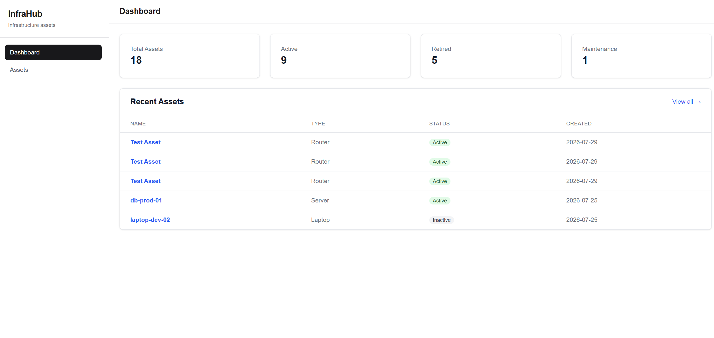
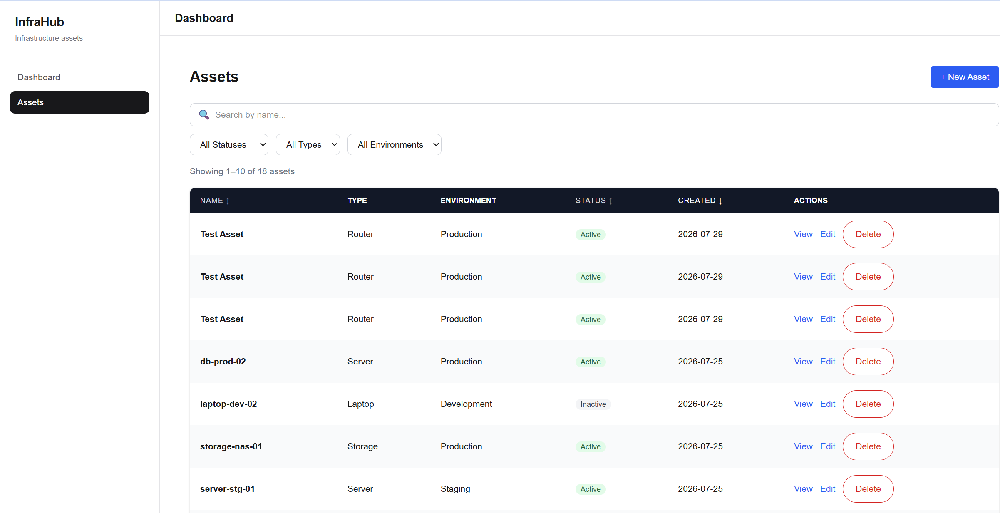

# InfraHub
[](https://github.com/Umutik/infrahub/actions/workflows/ci.yml)

InfraHub is a full-stack infrastructure asset management application built as a portfolio project to practice modern QA automation and full-stack development.

The application includes authentication, asset management, dashboard statistics, search and filtering, and an end-to-end Playwright automation framework following the Page Object Model (POM) pattern.

## Live Demo

Production: https://infrahub-livid.vercel.app

## CI/CD

InfraHub uses GitHub Actions and Vercel for continuous integration and deployment.

- Pull requests and pushes to `master` run linting, TypeScript checks, production build validation, and the full Playwright E2E suite.
- Production deployments are handled automatically through Vercel's GitHub integration.
- A separate manually triggered production smoke workflow validates the critical user journey against the live application.
- DEV and PROD use separate Supabase environments and test credentials.
- Playwright reports and test artifacts are available for failed CI runs.

---

## Tech Stack

### Frontend

- Next.js 16
- React
- TypeScript
- Tailwind CSS

### Backend

- Supabase
- PostgreSQL
- Supabase Authentication
- Row Level Security (RLS)

### Testing

- Playwright
- TypeScript
- Page Object Model (POM)
- GitHub Actions
- Automated E2E and smoke testing

### Deployment

- Vercel
- GitHub Actions

---

## Features

- User authentication
- Protected application routes
- Dashboard with asset statistics
- Create, view, edit, and delete assets
- Search assets by name
- Filter assets by:
  - Status
  - Asset Type
  - Environment
- Sortable asset data
- Pagination
- User-specific asset access using Supabase RLS
- Responsive UI

---

## Screenshots

### Dashboard



### Asset Management



---

## Test Coverage

The Playwright end-to-end suite covers critical application workflows including:

- Valid login
- Invalid login
- Dashboard
- Asset creation
- Asset editing
- Asset deletion
- Asset search
- Status filtering
- Asset type filtering
- Environment filtering
- Clearing filters
- Asset page behavior
- Smoke testing of the critical user journey

Current automation implementation:

- ✅ 14 Playwright tests
- ✅ Page Object Model architecture
- ✅ Stable role- and label-based locators
- ✅ Independent test data
- ✅ Automatic cleanup of test-created data
- ✅ DEV and PROD test environment separation
- ✅ Automated execution through GitHub Actions
- ✅ Production smoke testing against the deployed application
- ✅ Trace and screenshot capture on failures

---

## Running the Project Locally

### 1. Install dependencies

```bash
npm install
```

### 2. Configure environment variables

Create the required local environment files based on the example environment configuration.

The application requires Supabase configuration, and Playwright requires dedicated test-user credentials.

Do not commit real credentials or secrets to source control.

### 3. Start the development server

```bash
npm run dev
```

The application is available locally at:

```text
http://localhost:3000
```

---

## Running Tests

Run the full Playwright E2E suite:

```bash
npm run test:e2e
```

Run the smoke test:

```bash
npm run test:e2e:smoke
```

Run Playwright directly:

```bash
npx playwright test
```

Open the Playwright HTML report:

```bash
npx playwright show-report
```

---

## Test Environments

InfraHub separates development and production test execution.

### Development

The full Playwright suite runs against the development environment during CI.

```text
.env.test
```

### Production

Production smoke testing uses a separate configuration:

```text
.env.production.test
```

Production credentials are stored as GitHub Actions secrets and are not committed to the repository.

The production smoke test is manually triggered through GitHub Actions and validates the deployed Vercel application.

---

## CI Workflow

The main GitHub Actions CI workflow runs on pull requests and pushes to `master`.

The pipeline performs:

```text
Checkout
   ↓
Install dependencies
   ↓
Lint
   ↓
Type check
   ↓
Production build
   ↓
Install Playwright Chromium
   ↓
Run Playwright E2E tests
   ↓
Upload failure artifacts
```

A separate production smoke workflow can be triggered manually after deployment.

---

## Database

InfraHub uses PostgreSQL through Supabase.

The primary `assets` table contains fields including:

```text
id
asset_name
asset_type
environment
owner
status
description
created_at
updated_at
```

Row Level Security policies restrict asset operations to the authenticated owner.

The application supports:

- SELECT
- INSERT
- UPDATE
- DELETE

through authenticated, owner-scoped access.

---

## Project Structure

```text
app/
  (auth)/
  (dashboard)/
  api/

components/
  assets/
  ui/

lib/
  supabase/

services/

tests/
  e2e/
    auth/
    assets/
    dashboard/
    smoke/
  pages/

.github/
  workflows/
    ci.yml
    smoke.yml
```

The Playwright framework uses Page Objects including:

```text
LoginPage
DashboardPage
AssetsPage
AssetFormPage
```

---

## Test Data Strategy

Playwright tests generate unique asset names using a `PW-` prefix and timestamps.

Examples:

```text
PW-CREATE-...
PW-EDIT-...
PW-SEARCH-MATCH-...
PW-SMOKE-...
```

Tests that create persistent records clean up their test data after execution. The smoke test also removes the asset it creates, preventing automated test runs from polluting the test database.

---

## Future Improvements

- Docker support
- Device management module
- Business Services module
- Expanded API automation coverage
- Additional CI/CD quality gates

---

## Author

Built by Uma as a QA Automation portfolio project using Next.js, TypeScript, Supabase, Playwright, GitHub Actions, and Vercel.